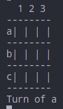

# Ruby Programming

## TIC_TAC_TOE

Build a tic-tac-toe game on the command line where two human players can play against each other and the board is displayed in between turns.

## Install & Play the Game

- Clone the project repo
- Make sure [Ruby-lang](https://www.ruby-lang.org/en/) is installed
- Run `ruby bin/main` 

## Game Play Rules & Details

The game board is a grid where each player takes a turn and plays.

- The game starts by prompting both players for their names.
- Player one always starts, then player two
- Symbol ('X') represents player one moves and ('O') represents player two.
- Valid inputs are (a1-a3, b1-b3, c1-c3), representing Row_Number & Column_Name
- In order to win the game, a player must place three of their marks in a horizontal, vertical, or diagonal row.
- There is a draw (or tie) if all cells are occupied without any player meeting the above conditions.

## Project Description

The project was implemented in the following milestones:

- Create game and player classes to hold the attributes and methods
- Assigned players name and symbol
- Checks for valid input and moves
- Created Game Flows
- Winner & draw functionality

## Designed With
- Ruby
- Git
- Gitflows
- Rubocop
- VS Code
- [Repl.it](https://repl.it/@AngelLuisLuis1/tic-tac-toe)

## Contribute to this Project

Contributions, issues, and feature requests are welcome! Start by:

  - Forking the project
  - Cloning the project to your local machine
  - cd into the project directory
  - Run git checkout -b your-branch-name
  - Make your contributions
  - Push your branch up to your forked repository
  - Open a Pull Request with a detailed description of the development branch of the original project for a review

## Authors

👤 **Muhammad Adeel Danish**

- GitHub: [@bashforger](https://github.com/bashforger)
- Twitter: [@bashforger](https://twitter.com/BashForge)
- LinkedIn: [@adeel](https://www.linkedin.com/Muhammad-adeel-danish)

👤 **Angel Barros**

- GitHub: [@Zappat0n](https://github.com/Zappat0n)
- Twitter: [@ngelBarros2](https://twitter.com/ngelBarros2)
- LinkedIn: [LinkedIn](https://www.linkedin.com/in/angel-luis-barros-pazos-8889011b5/)

## Show your support

Give a ⭐️ if you like this project!
